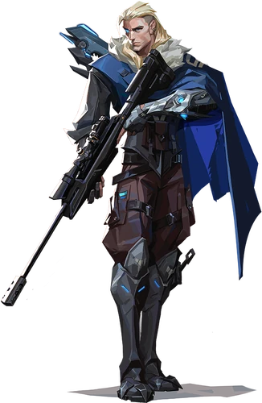

# Sova
---
## **Sova** - русский агент-зачинщик из игры ["***Valorant***"](https://Valorant.fandom.com/ru/wiki/Valorant)  
*Цитата при выборе агента
>*Где бы они ни были - я их найду*
---
## _Описание_
---
_Рожденный в вечной мерзлоте российского Заполярья, Sova выслеживает и уничтожает противников с холодной точностью и эффективностью. Этот первоклассный разведчик, экипированный особым луком, найдет вас, где бы вы ни прятались._
## *Способности*
---
|![Дрон-сова][DroneSova]|![Шоковая стрела][Shock]|![Разведстрела][Scan]|![Гнев охотника][Hunter]|
|:----------:|:----------:|:----------:|:----------:|
| [Дрон-сова](/DroneSova.md)| [Шоковая стрела](ShockDart.md)| [Разведстрела](Scanarrow.md)|[Гнев охотника](HuntersFury.md)|

[DroneSova]: Assets/TX_Sova_C.webp
[Shock]: Assets/TX_Sova_Q.webp
[Scan]:Assets/TX_Sova_E.webp
[Hunter]: Assets/TX_Sova_X.webp

Все материалы распространяются на основании лицензии [CC-BY-SA](https://creativecommons.org/licenses/by-sa/3.0/deed.ru)
